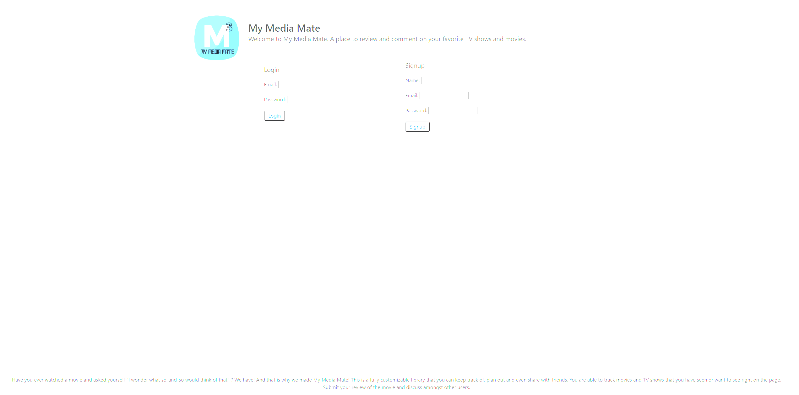
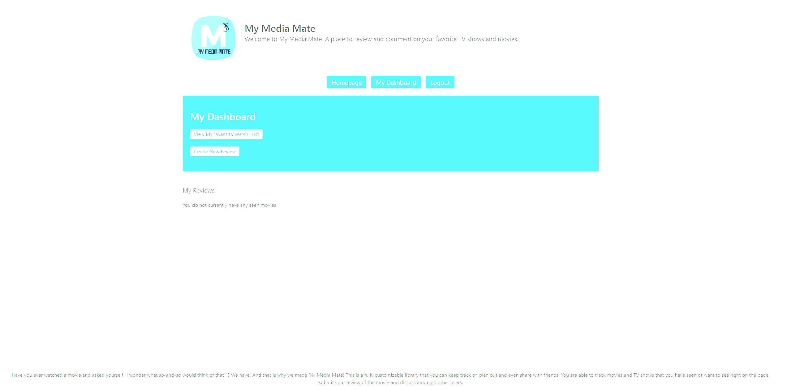

# My Media Mate

## Description

My Media Mate is an application for users to have a personal library of all of the movies and television shows they have watched and want to watch in the future.

Functionality:

- Users can "sign-up" and in subsequent visits can login to view their personal dashboard.
- Once logged in users can see a list of their viewed media along with their review of the movie or show.
- Reviews can be edited and/or deleted if desired.
- Users can comment on their reviews.
- Users can also view their custom list of Titles of movies and shows that they hope to see in the future.
- Once a title on this "Want to Watch" list is seen, the user has the ability to delete it from the list.

## Table of Contents

- [Usage](#usage)
- [Credits](#credits)
- [Technology Used](#tech)
- [License](#license)

## Usage

View the deployed app at https://whispering-ridge-05864.herokuapp.com/

## Credits

[Kristen's Repositories](https://github.com/kristenpicard)

[Kyle's Repositories](https://github.com/KyleEuman)

[Keith's Repositories](https://github.com/ktatad)

[Mo's Repositories](https://github.com/moagermo)

## Tech

## Questions

If you would like to discuss this project, please reach out to one of the contributors via GitHub. (Linked above)

## License

[MIT License Link](https://spdx.org/licenses/MIT.html)
